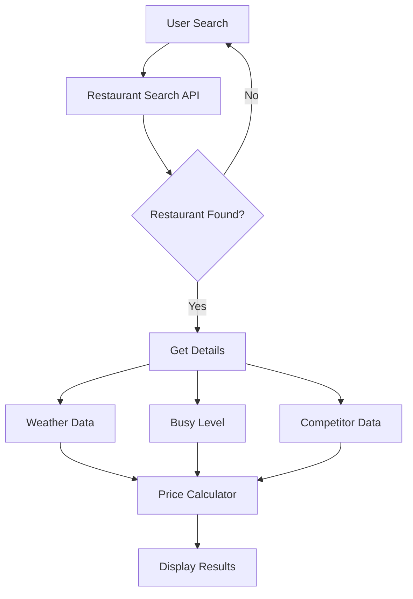

# Restaurant Dynamic Pricing Application

A Django-based web application that provides dynamic pricing recommendations for restaurant menu items based on real-time weather conditions, competitor pricing, and restaurant busy levels.

## 🌟 Features

- 🔍 Restaurant search with Google Places API
- 🌤️ Real-time weather integration
- 💰 Dynamic price calculations
- 📊 Competitor analysis
- 📱 Responsive Bootstrap UI

## 🔄 Application Flow



## 🚀 Getting Started

### Prerequisites

- Python 3.9.6+
- Django 4.2.17
- Google Places API key
- OpenWeather API key

### Installation

1. Clone the repository:
```bash
git clone <repository-url>
cd restaurant_pricing
```

2. Create a virtual environment:
```bash
python -m venv venv
source venv/bin/activate  # On Windows: venv\Scripts\activate
```

3. Install dependencies:
```bash
pip install -r requirements.txt
```

4. Configure environment variables:
Create a `.env` file in the project root:
```env
OPENWEATHER_API_KEY=your_openweather_api_key
GOOGLE_MAPS_API_KEY=your_google_maps_api_key
```

5. Run migrations:
```bash
python manage.py migrate
```

6. Start the development server:
```bash
python manage.py runserver 8001
```

## 🔧 Configuration

### Google Cloud Console Setup

1. Go to [Google Cloud Console](https://console.cloud.google.com)
2. Create a new project or select existing
3. Enable the following APIs:
   - Places API
   - Maps JavaScript API
   - Geocoding API
4. Create credentials (API key)
5. Add the API key to your `.env` file

## 💻 Usage

1. Access the application at `http://127.0.0.1:8001`
2. Search for a restaurant by name
3. View restaurant details and current conditions
4. See dynamic pricing recommendations

## 🧮 Pricing Algorithm

The dynamic pricing algorithm considers multiple factors:

### Input Factors
- Current temperature (°F)
- Weather conditions
- Restaurant busy level (%)
- Competitor prices

### Logic Flow
```python
if (temperature < 45°F OR bad_weather) AND busy_level > 70%:
    markup = 1.1 + (busy_level - 70) / 100  # 1.1 to 1.3
    price = max(lowest_competitor_price * markup, base_price)
else:
    price = lowest_competitor_price
```

## 🏗️ Project Structure

```
restaurant_pricing/
├── pricing/
│   ├── services.py      # API integrations and pricing logic
│   ├── views.py         # View controllers
│   ├── models.py        # Data models
│   └── templates/       # HTML templates
├── static/              # Static files (CSS, JS)
├── .env                 # Environment variables
└── manage.py           # Django management script
```

## 🔌 API Integrations

### Google Places API
- Restaurant search
- Restaurant details
- Nearby competitor data
- Busy level estimation

### OpenWeather API
- Current temperature
- Weather conditions
- Weather descriptions

## 🛠️ Services

### GooglePlacesService
Handles all restaurant-related API calls:
- Search restaurants
- Get restaurant details
- Find nearby competitors

### WeatherService
Manages weather data retrieval:
- Get current conditions
- Temperature conversion
- Weather status

### PricingService
Implements the dynamic pricing algorithm:
- Calculate optimal prices
- Process competitor data
- Apply weather/busy factors

## 🔒 Security Considerations

- API keys stored in environment variables
- Input validation for all user inputs
- Error handling to prevent data leaks
- Rate limiting for API calls

## 📈 Future Enhancements

1. Machine Learning Integration
   - Price prediction models
   - Demand forecasting
   - Seasonal adjustments

2. Advanced Features
   - Real-time competitor tracking
   - Historical price analysis
   - User feedback system
   - Price optimization reports

3. Performance Improvements
   - API response caching
   - Database optimization
   - Background task processing

## 🤝 Contributing

1. Fork the repository
2. Create a feature branch
3. Commit your changes
4. Push to the branch
5. Create a Pull Request

## 📝 License

This project is licensed under the MIT License - see the LICENSE file for details.

## 👥 Authors

- Your Name - Initial work

## 🙏 Acknowledgments

- Google Places API
- OpenWeather API
- Django Framework
- Bootstrap Team
